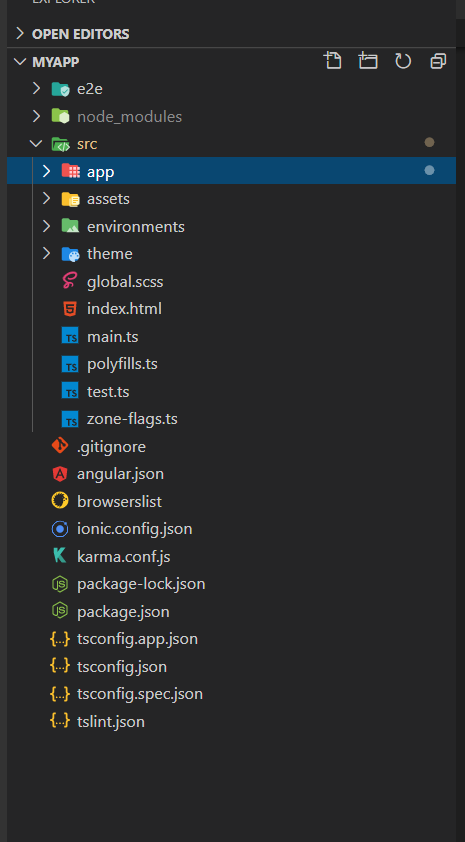
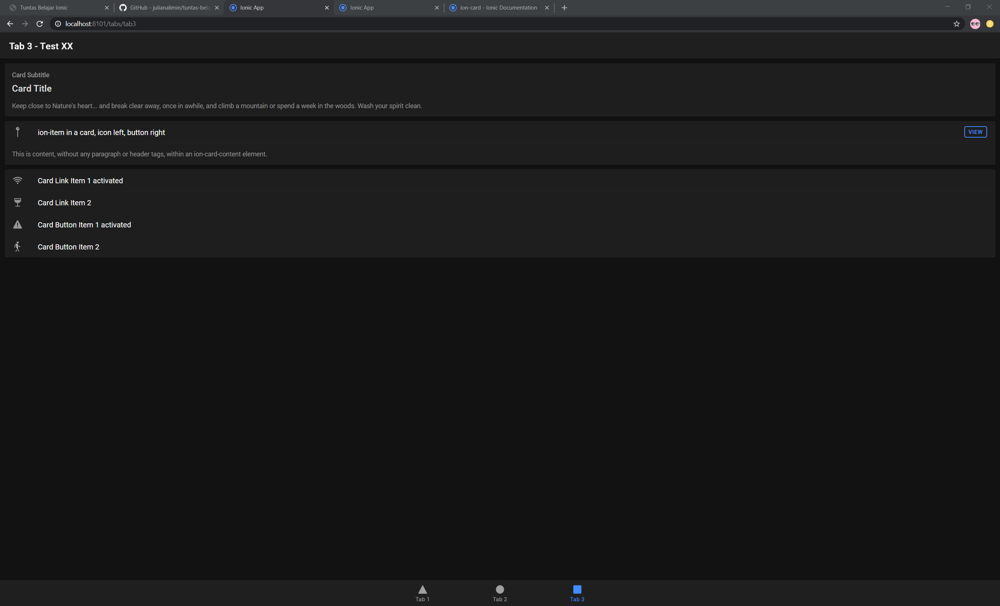
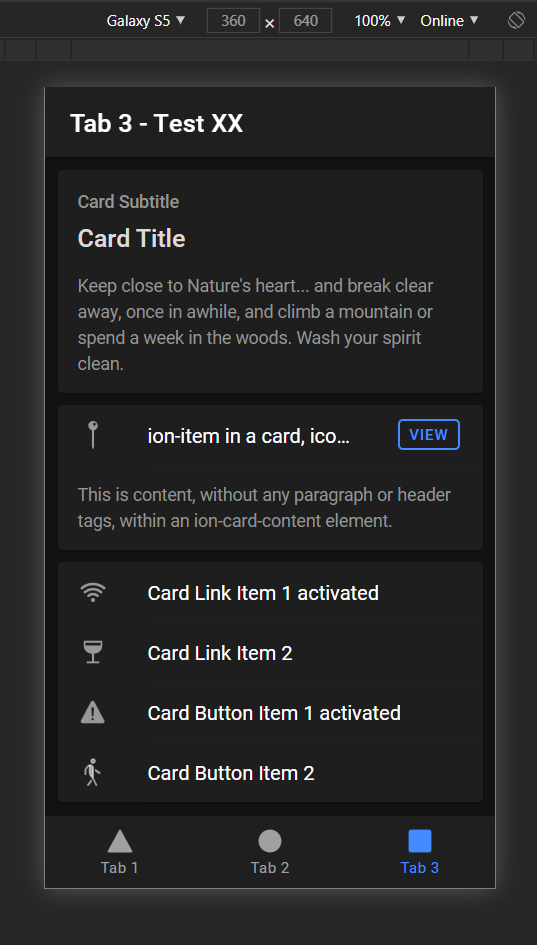

<!-- section 0 -->

# Tuntas Belajar Ionic {#tuntas-belajar-ionic .light-on-dark bg="#123456"}

Oleh:
Julian Alimin

| 
| 

Cari saya di link-link berikut

[](https://github.com/dmastag){target="_blank"}
[](https://www.linkedin.com/in/julianalimin){target="_blank"}
[](https://www.youtube.com/c/JulianAlimin){target="_blank"}
[](https://www.facebook.com/julianalimin){target="_blank"}
[](https://twitter.com/julianalimin){target="_blank"}
[](https://www.instagram.com/julianalimin/?hl=en){target="_blank"}

<!-- section 1 -->

# Daftar Isi

## 

-   [Pengantar](#pengantar)

-   [Tentang Penulis](#tentang-penulis)

<!-- subsection 1 / 1 -->

## Mengenal Ionic

-   [Apa itu Ionic](#apa-itu-ionic)

-   [Project Ionic Pertamaku](#project-ionic-pertamaku)

<!-- subsection 1 / 2 -->

## Project: Tuntas Belajar App

Pages

-   [Perencanaan](#section-16)

-   [List Tutorial ala Skillshare]()

-   [Youtube Player]()

-   [List Pembelajaran]()

-   [About Page]()

-   [Contact Me]()

<!-- subsection 1 / 3 -->

## Project: Tuntas Belajar App

Advanced

-   [Login]()

-   [Admin untuk baca Contact]()

-   [Push Notification]()

<!-- subsection 1 / 4 -->

## Upload Aplikasi untuk Publik

-   [Upload ke Google Play Store]()

-   [Otomatisasi Upload ke Google Play Store]()

-   [Upload ke Apple App Store]()

-   [Otomatisasi Upload ke Apple App Store]()

-   [Upload ke Huawei App Gallery]()

<!-- subsection 1 / 5 -->

## Qualitas Aplikasi dan Coding

-   [ngLint]()

-   [Karma]()

-   [Protractor]()

-   [Sonarqube]()

-   [Codecov]()

<!-- section 2 -->

#  {#section-1 .light-on-dark bg="#123456"}

## Pengantar

```{=html}
<iframe src="https://www.youtube.com/embed/ZcY56CJmPpU">
```
```{=html}
</iframe>
```
Atau navigasi kebawah untuk lihat versi Text

<!-- subsection 2 / 1 -->

## Selamat Datang

Tujuan Belajar Tuntas Ionic adalah sebagai salah satu pilihan untuk belajar Ionic berbahasa Indonesia.

<!-- subsection 2 / 2 -->

## Isi Pembelajaran

-   Penjelasan Ionic
-   Automatisasi Testing dan Code Coverage
-   Automatisasi Deployment

<!-- subsection 2 / 3 -->

## Target Audience

-   Developer/Engineer
-   Quality Assurance
-   Devops

<!-- subsection 2 / 4 -->

## 

Isi pembelajaran ini akan terus diupdate dengan harapan suatu saat benar-benar tuntas

<!-- subsection 2 / 5 -->

## 

Jika ingin memberikan masukkan Materi atau bahkan ingin menyumbangkan isian maka bisa lgs saja membuka Issue atau submit Pull Request ke.

<https://github.com/julianalimin/tuntas-belajar-ionic>

<!-- section 3 -->

# Tentang Penulis {#tentang-penulis .light-on-dark bg="#123456"}

## 

Hi, nama Saya Julian Alimin


<!-- subsection 3 / 1 -->

##  {#section-5 .light-on-dark bg="#123456;assets/julian-vp-engineering.jpg"}

Saat ini saya menjabat sebagai VP of Engineering di GreatDay HR dimana kami membuat aplikasi HRIS Mobile First berbasis Ionic dengan jumlah pengguna harian lebih dari 200 ribu

<!-- subsection 3 / 2 -->

##  {#section-6 bg="#123456;assets/julian-first-id-card.jpg"}

Saya memiliki 15 Tahun pengalaman kerja di Dunia IT mencakup Development, Implementasi & Maintenance Product ( dan kadang juga bantu Sales Support 😎 )

<!-- subsection 3 / 3 -->

##  {#section-7 bg="#123456;assets/julian-football.jpg"}

Hobby saya diantaranya adalah bermain Bola serta ngoprek-ngoprek technology terbaru ( jika ada budgetnya 😃 )

<!-- subsection 3 / 4 -->

##  {#section-8 bg="#123456;assets/julian-family.jpg"}

Dan di waktu senggang saya senang menghabiskan waktu dengan Keluarga

<!-- subsection 3 / 5 -->

## 

Cukup tentang saya, mari lanjut ke Materi

> Belajar Tuntas Ionic

<!-- section 4 -->

# Apa itu Ionic ?

## 

```{=html}
<iframe src="https://www.youtube.com/embed/YGxaPyPzd44">
```
```{=html}
</iframe>
```
Atau navigasi kebawah untuk lihat versi Text

<!-- subsection 4 / 1 -->

## 

Menurut website resminya:

Ionic's open source **Framework** and developer-friendly **tools** and **services** power apps for some of the world's best-known brands

<!-- subsection 4 / 2 -->

## 

Kita ambil 3 Kata Benda yang digunakan oleh Ionic:

-   Framework
-   Tools
-   Services

<!-- subsection 4 / 3 -->

## 


<!-- subsection 4 / 4 -->

## 

-   Framework: Library dan UI Komponen untuk membuat Aplikasi
-   Tools: Penunjang penggunaan seperti Ionic CLI, Stencil, Capacitor, Ionic Native
-   Services: Online Service (Ionic Appflow/Cloud)

<!-- subsection 4 / 5 -->

## Framework Ionic

Bersifat Framework Agnostic sehingga bisa digunakan dengan Framework apa saja (Angular, React Vue) atau dengan Vanilla Javascript.

<!-- subsection 4 / 6 -->

## Konsep Framework

-   @ionic/core --\> UI Components
-   @ionic/angular
-   @ionic/react
-   @ionic/vue

<!-- subsection 4 / 7 -->

## Tools

-   Ionic CLI: Untuk installasi dan jalankan Toolchain
-   Stencil: Untuk membuat web component native
-   Capacitor: Evolusi dari Cordova
-   Ionic Native: Plugin-plugin Cordova/Capacitor untuk akses Fitur Native

<!-- subsection 4 / 8 -->

## Services

Ionic Appflow (dulunya Ionic Cloud) merupakan kumpulan Tools berbayar untuk membantu development Ionic. Beberapa Fiturnya:

-   Authentikasi
-   Automated Build
-   Hot Push

<!-- section 5 -->

# Project Ionic Pertamaku

## 

```{=html}
<iframe src="https://www.youtube.com/embed/v_cJ1iJ_LvY">
```
```{=html}
</iframe>
```
Atau navigasi kebawah untuk lihat versi Text

<!-- subsection 5 / 1 -->

## Persiapan

Hal minimal yang dibutuhkan adalah [Node JS](https://nodejs.org/){target="_blank"} dan sebuah IDE (Saya merekomendasikan [VS Code](https://code.visualstudio.com/){target="_blank"})

> Pro Trip: Gunakan NVM

<!-- subsection 5 / 2 -->

## Memulai Project

``` {.shell}
## Cara yang direkommendasikan Ionic
npm install -g @ionic/cli
ionic start myApp tabs

## Cara yang saya rekomendasikan
npx --package @ionic/cli ionic start myApp tabs
atau
npx -p @ionic/cli ionic start myApp tabs
```

<!-- subsection 5 / 3 -->

## Run Project di Lokal

``` {.shell}
npx -p @ionic/cli ionic serve
```

<!-- subsection 5 / 4 -->

## Struktur Project



<!-- subsection 5 / 5 -->

## Hasil yang ditampilkan (Browser)



<!-- subsection 5 / 6 -->

## Hasil yang ditampilkan (Mobile)



<!-- section 6 -->

# Perencanaan

## 

*Failing to Plan is Planning to Fail*

*Gagal berencana adalah berencana untuk Gagal*

<!-- subsection 6 / 1 -->

## Sebelum Coding

Hal terpenting sebelum mulai coding adalah perencanaan.

<!-- subsection 6 / 2 -->

## Design

Banyak Tools yang bisa digunakan untuk Design. Figma dan XD adalah dua Tools yang sangat digemari sekarang. Setidaknya buatlah Mood Board agar tahu arah Aplikasinya akan kemana.

<!-- subsection 6 / 3 -->

## Project Management

Pekerjaan perlu di pecah menjadi beberapa bagian. Biasanya saya menggunakan Trello tetapi Github dan Gitlab menawarkan Project Management sederhana yang terintegrasi dengan website mereka sehingga tidak memerlukan sistem lain.
