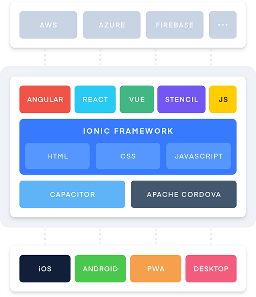

# Apa itu Ionic ?

## 
Menurut website resminya:

Ionic’s open source **Framework** and developer-friendly **tools** and **services** power apps for some of the world’s best-known brands

## 
Kita ambil 3 Kata Benda yang digunakan oleh Ionic:

* Framework
* Tools
* Services

##

## 

* Framework: Library dan UI Komponen untuk membuat Aplikasi
* Tools: Penunjang penggunaan seperti Ionic CLI, Stencil, Capacitor, Ionic Native
* Services: Online Service (Ionic Appflow/Cloud)