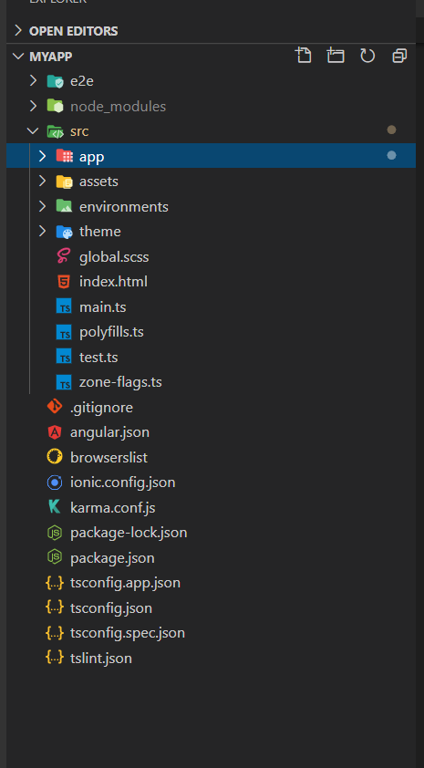
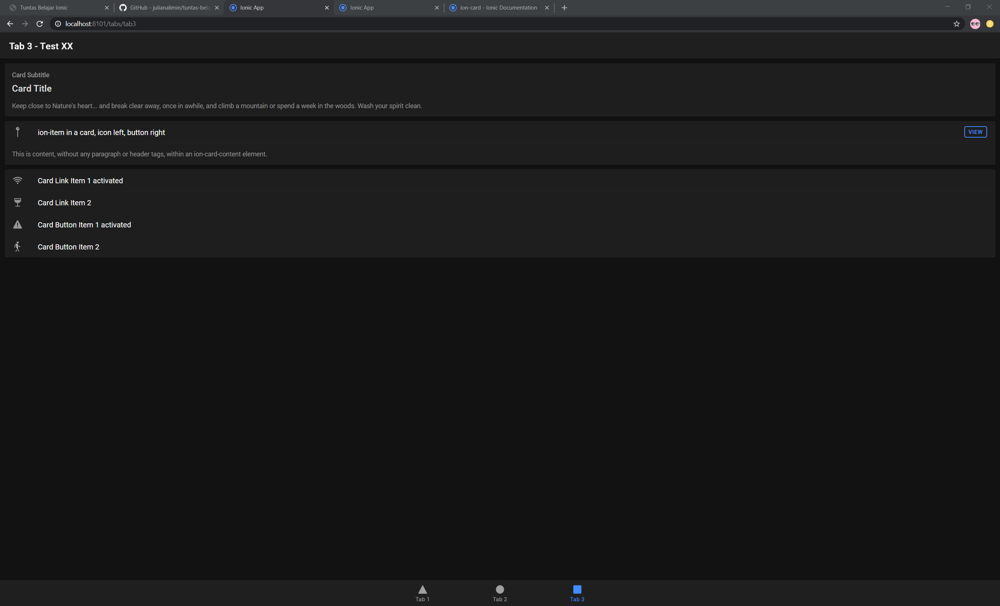
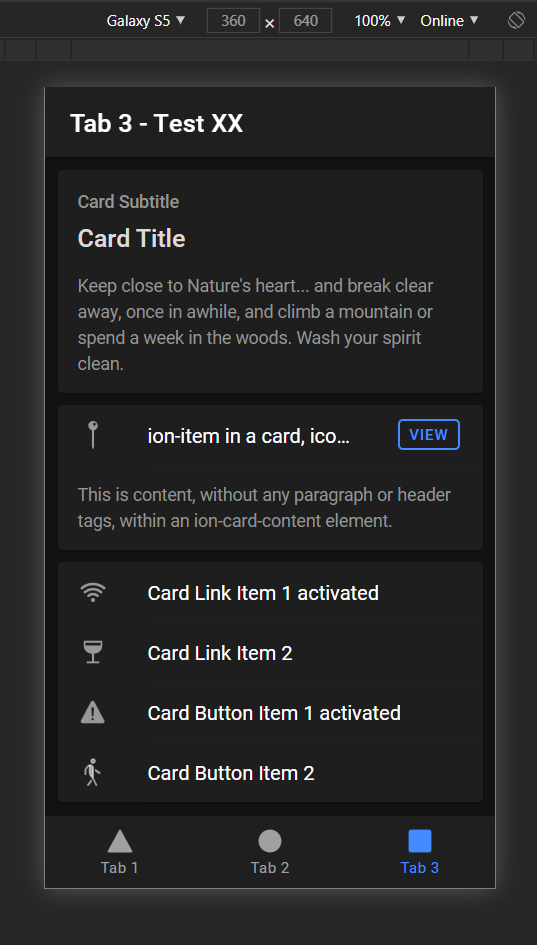

# Project Ionic Pertamaku

##
<iframe src="https://www.youtube.com/embed/v_cJ1iJ_LvY"></iframe>

Atau navigasi kebawah untuk lihat versi Text

## Persiapan

Hal minimal yang dibutuhkan adalah [Node JS](https://nodejs.org/){target="_blank"} dan sebuah IDE (Saya merekomendasikan [VS Code](https://code.visualstudio.com/){target="_blank"})

> Pro Trip: Gunakan NVM


## Memulai Project

```shell
## Cara yang direkommendasikan Ionic
npm install -g @ionic/cli
ionic start myApp tabs

## Cara yang saya rekomendasikan
npx --package @ionic/cli ionic start myApp tabs
atau
npx -p @ionic/cli ionic start myApp tabs
```

## Run Project di Lokal

```shell
npx -p @ionic/cli ionic serve

## atau install @ionic/cli sebagai dev dependency
## agar npx tidak selalu menginstall
npm install -E -D @ionic/cli

## lalu jika ingin menjalankan cukup
npx ionic serve

## atau gunakan script npm
npm run start
```
## Struktur Project


## Hasil yang ditampilkan (Browser)


## Hasil yang ditampilkan (Mobile)

