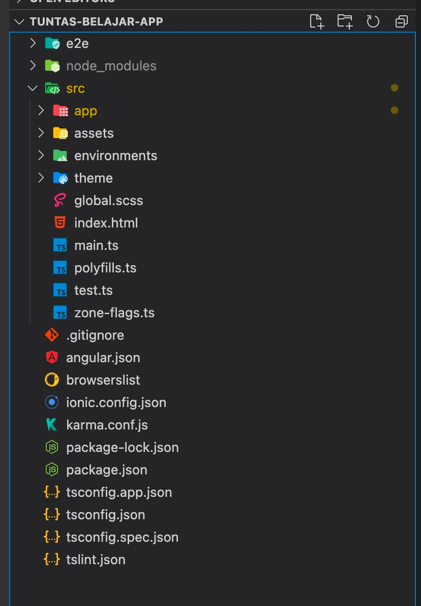

# Kupas Struktur Aplikasi Ionic Angular

##
<iframe src="https://www.youtube.com/embed/kKkBWKCcYiE"></iframe>

Atau navigasi kebawah untuk lihat versi Text

##

## package.json

Dikarenakan ini project Nodejs maka sudah pasti ada file `package.json` dan `package-lock.json` untuk mengatur daftar scripts dan dependencies dari npm yang perlu diinstall untuk menjalankan project ionic kita. 

## Apa yang terjadi saat project di Run?

Dikarenakan kita menggunakan Angular para Project ini, maka saat memanggil script untuk menserve dia sebetulnya menjalankan perintah angular. Dimana Angular akan mengcompile dan membuat beberapa chunk dan menjalankan sebuah Web Server di localhost untuk melihat hasilnya di Browser.

## tslint.json

Berisi rules linting dari Typescript.

## tsconfig.json

Ini adalah configurasi dari typescript compiler kita. Contoh setupnya seperti apa target bahasanya misalnya es2015, informasi kemana hasil compiling akan diletakkan dan lainnya.

## karma.conf.json

Ini configurasi Karma runner yang digunakan saat melakukan Unit Testing dengan Karma.

## ionic.config.json

Digunakan untuk setup Ionicnya. Jika kita menggunakan beberapa fitur Ionic di Cloud (App flow) maka configurasinya akan diletakkan disini juga.

## browserslist

Untuk mencatat daftar target browser saat Angular membuild Project ini.

## angular.json

Configurasi Angular dari mulai nama Project, jenis-jenis isi di Projectnya, dll. 

## .gitignore

Untuk configurasi file-file apa yang tidak perlu masuk ke Git. Dari Ionic sudah dibantu dengan isian dari default template mereka seperti node_modules dan build folder tidak usah masuk Git.

## Folder e2e

Digunakan untuk seluruh Configurasi dan Script End-To-End Test. Lebih detil nanti

## Folder node_modules

Seluruh dependency dari package.json didownload dan di build disini. Folder ini besar dan sengaja tidak dimasukkan ke Git.

## Folder src

Berisi seluruh coding aplikasi kita. Disinilah sebagian besar development terjadi.

## src/zone-flags.ts

File ini untuk mengatur change detection pada aplikasi Angular

## src/test.ts

File Test untuk Unit Testing. Ini yang akan dijalankan oleh Karma nanti.

## src/pollyfills.ts

Agar aplikasi kita dapat tetap berjalan pada jenis browser-browser yang lama maka file ini akan mengakali beberapa library agar tetap bisa digunakan. Tapi tetap saran saya sih user agar menggunakan browser jenis terbaru.

## src/main.ts

Ini adalah file root dari Angular yang akan meenjalankan seluruh aplikasi Angularnya.

## src/index.html

Ini adalah file pertama yang akan dijalankan oleh Browser. Dan Angular akan menginject diri ke file ini sehingga aplikasinya bisa berjalan.

## src/global.scss

File ini mengatur styling css dari seluruh aplikasi. Jika ada library external yang mau dimasukkan secara global maka pastinya perlu dimasukkan kesini.

## src/theme/variable.scss

Variabel untuk mengcustomisasi styling biasanya diletakkan disini.

## src/environments

File-file disini digunakan untuk setting/parameter tambahan saat menjalankan Angular. Biasanya digunakan untuk membedakan url server production dan development atau flag-flag lainnya. 

## src/assets

File-file seperti gambar, fonts, json, file untuk bahasa  dan dokument diletakkan disini karena tidak perlu dicompile dan hanya dipanggil saja.

## src/app/app.module.ts

File main.ts akan memanggil file ini untuk memulai menginisasi module-module yang akan digunakan. Lalu apakah entry component (komponen pertama yang akan dipanggil) juga di konfigurasi disini.

## src/app/app.component.ts

Ini umumnya adalah Komponen pertama yang dipanggil. Sehingga biasanya script-script inisiasi Aplikasi ada disini.

## Template Component

Umumnya sebuah komponen akan menampilkan html. Ini disebut template. Template dapat ditulisan di dalam file .ts si Komponen atau menggunakan templateUrl diarahkan ke file html yang akan menjadi templatenya.

## Styling component

Setiap komponent jika memerlukan Styling maka dapat ditambahkan inlince styling atau styleurls. Dengan beitu sebuah file css/scss terpisah akan dipanggil untuk membantu styling.

## Routing Module

Jika Aplikasi kita memiliki banyak page maka setiap Page perlu diarahkan ke URL pada Browser. Ini dilakukan di Routing Module. Setiap Module dapat memiliki Routing Module jadi setiap Module dapat bekerja secara autonom.
